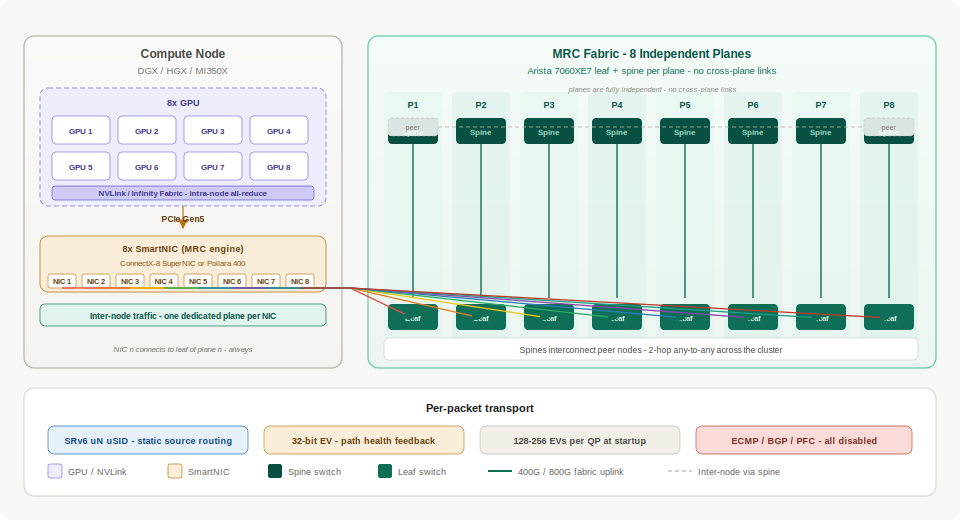

# Multiplanar Fabric AI Networking Primer

Reference architecture and design diagrams for **MRC (Multipath Reliable Connection)** networking — the OCP-standard approach to scaling AI training clusters over deterministic, multi-plane Ethernet fabrics.

MRC replaces traditional InfiniBand-style fat-tree designs with **eight fully independent fabric planes**, static SRv6 source routing, and NIC-driven path selection. The result is predictable, high-bandwidth inter-node communication for distributed training workloads without ECMP, dynamic routing, or application changes.

---

## What is MRC?

**Multipath Reliable Connection (MRC)** is defined in [OCP MRC Rev 1.0](https://www.opencompute.org/documents/ocp-mrc-1-0-pdf) and targets large-scale GPU clusters where collective operations (all-reduce, all-gather) dominate inter-node traffic.

| Principle | Description |
|-----------|-------------|
| **Eight independent planes** | Each plane is a dedicated leaf–spine pair with no cross-plane links. Traffic on plane *n* never traverses plane *m*. |
| **NIC-to-plane wiring** | NIC *n* on every node connects to the leaf switch of plane *n*. This discipline is the foundation of the entire design. |
| **Static SRv6 routing** | Paths are encoded in an SRv6 uN uSID stack at the destination address. Switches perform deterministic uSID shifts — no BGP, no ECMP. |
| **32-bit Entropy Value (EV)** | A per-packet identifier striped across the IPv6 flow label and UDP source port. EVs are generated at QP startup (128–256 per QP, split across planes) and echoed in SACK/NACK feedback for path health monitoring. |
| **Lossy Ethernet RDMA** | PFC is disabled. The MRC engine in the SmartNIC handles retransmission and congestion response at the transport layer. |

At the node level, **intra-node** traffic (NVLink on Nvidia, Infinity Fabric on AMD) handles local all-reduce, while **inter-node** traffic flows through MRC-capable SmartNICs over the eight-plane fabric.

---

## Glossary

Unfamiliar with **uN**, **PSP**, **FRR**, **EV**, or other terms in these pages? See the **[Glossary](glossary.md)** — definitions for MRC transport, SRv6 uSID micro-behaviors, behavior flavors, SONiC stack components, and fabric acronyms.

---

## Documentation map

### Protocol & packet format

Understand how MRC encodes paths and entropy in every packet.

- **[MRC Packet Structure — SRv6 + Entropy Value](generated/srv6-mrc-packet-ev-header.md)** — IPv6-in-IPv6 encapsulation, outer SRv6 uN uSID stack, 32-bit EV placement, and the role of EV in SACK/NACK feedback (not forwarding).
- **[SRv6 uN uSID — Leaf/Spine Config (SONiC vs Arista)](srv6-usid-leaf-spine-config.md)** — Side-by-side SONiC and Arista EOS 4.36 programming model, F3216 addressing plan, and concrete leaf/spine templates for MRC static fabrics.
- **[MRC Packet Spray Animation](generated/mrc-packet-spray-animation.md)** — Interactive simulation of per-packet EV spray across eight planes, with congestion, trimming, failure, and NACK re-steering.

### Node-level integration

How individual compute nodes connect GPUs to the eight-plane fabric.

- **[Nvidia DGX H100 — MRC Fabric Integration](generated/dgx-mrc-diagram-1.md)** — NVLink/NVSwitch for intra-node all-reduce; ConnectX-7 NICs for inter-node MRC at 8 × 400G (3.2 Tbps per node).
- **[AMD MI350X — MRC SRv6 Fabric Connectivity](generated/amd-mi350x-mrc-srv6-fabric.md)** — AMD Instinct MI350X with Pensando Pollara 400 NICs; OCP MRC Rev 1.0 ibverbs shim via RCCL; AMD vs Nvidia node comparison on the same fabric.

!!! note "Vendor-agnostic fabric"
    MRC is fabric-agnostic. Both Nvidia and AMD nodes implement the same OCP MRC Rev 1.0 semantics — identical EV generation, SRv6 forwarding, and plane wiring. An Arista 7060XE7 switch sees indistinguishable traffic from either vendor, making mixed AMD + Nvidia clusters architecturally valid.

### Rack & data center deployments

End-to-end rack layouts pairing compute with MRC fabric switches.

- **[72-GPU MRC Rack — Arista 7060XE7 + Nvidia DGX H100](generated/mrc-72gpu-rack-diagram-1.md)** — 9 × DGX H100 (72 GPUs), 16 × 7060XE7 (8 leaf + 8 spine), 28.8 Tbps aggregate, 2-hop any-to-any.
- **[72-GPU Blackwell Ultra MRC Rack — Arista 7060XE7 + Nvidia HGX B300](generated/mrc-blackwell-ultra-rack-1.md)** — 9 × HGX B300 with ConnectX-8 SuperNICs at 800G per uplink, 57.6 Tbps aggregate — same MRC discipline at double the link speed.
- **[GB300 NVL72 — Liquid-Cooled Data Center Rack](generated/gb300-nvl72-dc-rack-1.md)** — 48U MGX rack with 72 × B300 GPUs, CDU cooling loop, 135 kW TDP, and integrated MRC fabric switching at rack scale.

---

## Key design parameters

| Parameter | H100 generation | Blackwell generation |
|-----------|-----------------|---------------------|
| NIC | ConnectX-7 | ConnectX-8 SuperNIC |
| Uplink speed | 400G per plane | 800G per plane |
| NICs per node | 8 | 8 |
| Fabric BW per node | 3.2 Tbps | 6.4 Tbps |
| Leaf/spine switch | Arista 7060XE7 | Arista 7060XE7 |
| Planes | 8 (independent) | 8 (independent) |
| Routing | SRv6 uN uSID (static) | SRv6 uN uSID (static) |
| EVs per QP | 128–256 | 128–256 |
| ECMP / dynamic routing | Disabled | Disabled |

---

## Architecture at a glance

Each plane operates as an isolated 2-hop leaf–spine network. A 72-GPU rack typically pairs nine compute nodes with sixteen Arista 7060XE7 switches — one leaf and one spine per plane — delivering deterministic any-to-any connectivity for collective traffic.

---

## Getting started

Browse the **Pages** section in the navigation sidebar for interactive SVG diagrams covering node topology, rack wiring, packet headers, and vendor comparisons. Each page is a self-contained reference diagram with legends, callouts, and design notes.

---

## Resources

- [OCP MRC Rev 1.0 specification](https://www.opencompute.org/documents/ocp-mrc-1-0-pdf)
- [Resilient AI Supercomputer Networking using MRC and SRv6 (OpenAI)](https://cdn.openai.com/pdf/resilient-ai-supercomputer-networking-using-mrc-and-srv6.pdf)
- [Arista 7060XE7 datasheet](https://www.arista.com/assets/data/pdf/Datasheets/7060XE7-Datasheet.pdf)
