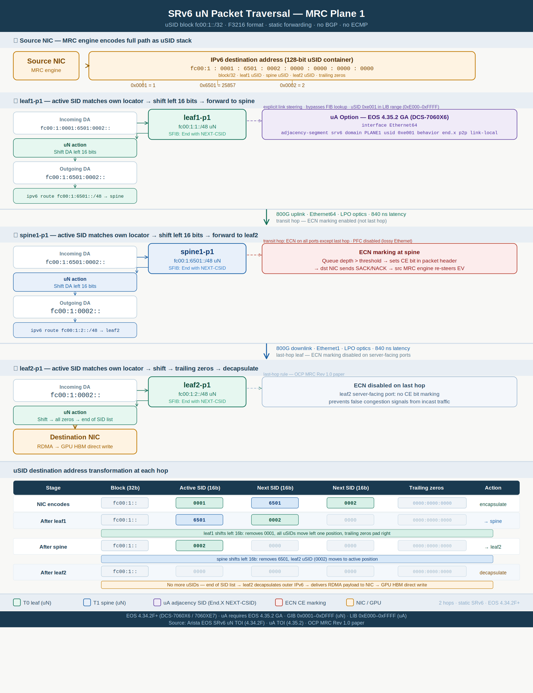

# SRv6 Plane 1 — Packet Traversal

Step-by-step view of how an **MRC training packet** crosses **Plane 1** using **SRv6 uN** (micro-node) segments. The diagram walks a single flow from a source NIC through **leaf1-p1 → spine1-p1 → leaf2-p1** to a destination GPU, showing the **128-bit IPv6 destination address** transformation at every hop.

This complements the [Arista EOS SRv6 uN + uA configuration](arista-eos-srv6-un-ua-config.md) for the same plane and the broader [SONiC vs Arista leaf/spine reference](srv6-usid-leaf-spine-config.md).

!!! note "Scope"
    The example uses the **Plane 1 addressing plan** (`fc00:1::/32` block, F3216 uSID format). Paths are **static** — no BGP, no ECMP, no dynamic routing. ECN marking follows MRC rules: enabled on transit hops, disabled on the last server-facing hop.

---

## Topology and path

The worked example encodes a **three-hop uN path** (two transit switches plus destination leaf):

| Hop | Device | Role |
|-----|--------|------|
| 0 | Source NIC | Encapsulates outer IPv6 DA with uSID stack |
| 1 | **leaf1-p1** | uN shift → static route to spine uN |
| 2 | **spine1-p1** | uN shift → static route to leaf2 uN |
| 3 | **leaf2-p1** | Final uN shift → decapsulate to destination NIC |

**Encoded uSID stack (source → destination):** `leaf1 (0x0001)` → `spine1 (0x6501)` → `leaf2 (0x0002)`

---

## Diagram

---

## uSID destination address transformation

Each transit switch matches the **active 16-bit uSID** against its local `/48` locator, **left-shifts the address by 16 bits**, then performs a **static FIB lookup** on the shifted prefix.

| Stage | Block (32b) | Active SID | Next SID | Next SID | Trailing zeros | Action |
|-------|-------------|------------|----------|----------|----------------|--------|
| NIC encodes | `fc00:1::` | `0001` | `6501` | `0002` | `0000:0000:0000` | encapsulate |
| After leaf1 | `fc00:1::` | `6501` | `0002` | `0000` | `0000:0000:0000` | → spine |
| After spine | `fc00:1::` | `0002` | `0000` | `0000` | `0000:0000:0000` | → leaf2 |
| After leaf2 | `fc00:1::` | `0000` | `0000` | `0000` | `0000:0000:0000` | decapsulate |

The **32-bit EV** in the outer header (not shown in this diagram) is used for SACK/NACK feedback on the NIC — it does not participate in switch forwarding. See [MRC Packet Structure](generated/srv6-mrc-packet-ev-header.md).

---

## uA adjacency segments (optional)

The diagram notes an **uA (adjacency) option** available in **EOS 4.35.2 GA+**. Where uN relies on post-shift FIB lookup, uA pins traffic to a **specific egress interface** using a uSID in the **LIB range** (`0xE000`–`0xFFFF`).

A source NIC can mix uN and uA in the same uSID container — for example, forcing leaf→spine egress via a particular uplink while keeping node segments elsewhere. Configuration examples and verification commands are in [Arista EOS SRv6 uN + uA Config — Plane 1](arista-eos-srv6-un-ua-config.md).

---

## ECN and last-hop behavior

| Location | ECN marking | Rationale |
|----------|-------------|-----------|
| leaf1 uplink, spine downlinks | **Enabled** | Transit hops signal congestion to the MRC NIC |
| leaf2 server-facing ports | **Disabled** | Last-hop rule — avoids false congestion signals from incast |

---

## Platform and uSID ranges

| Item | Value |
|------|-------|
| Platforms | Arista **DCS-7060X6** / **7060XE7** |
| EOS | **4.34.2F+** (uN); **4.35.2 GA+** (uA) |
| uSID format | **F3216** — 32-bit block + 16-bit uSID |
| uN range (GIB) | `0x0001`–`0xDFFF` — node segments |
| uA range (LIB) | `0xE000`–`0xFFFF` — adjacency segments |

---

## Related pages

- [Arista EOS SRv6 uN + uA Config — Plane 1](arista-eos-srv6-un-ua-config.md)
- [SRv6 uN uSID — Leaf/Spine Config (SONiC vs Arista)](srv6-usid-leaf-spine-config.md)
- [MRC Packet Structure — SRv6 + Entropy Value](generated/srv6-mrc-packet-ev-header.md)
- [Glossary](glossary.md)
