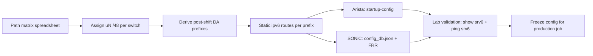

# SRv6 uN uSID — Leaf/Spine Config Reference (SONiC vs Arista EOS)

Reference for **static SRv6 uN uSID** programming on MRC leaf–spine fabrics. Covers the comparison between **SONiC** (FRR + ConfigDB + SAI) and **Arista EOS 4.36** (**7060XE7** / Tomahawk 6 — MRC rack reference design), with **concrete configuration templates** for a single MRC plane inside a 72-GPU rack.

See the **[Glossary](glossary.md)** for definitions of uN, uA, PSP/USD, F3216, ConfigDB, and related terms.

!!! note "Scope"
    Templates use an **illustrative addressing plan** aligned with OCP MRC / OpenAI MRC semantics (F3216 uSID, static tables, no ECMP, no dynamic routing). Replace interface names, link-local next hops, and uSID values with your deployment spreadsheet before production use.

---

## Documentation sources

| System | Document | Role for uN/uSID |
|--------|----------|------------------|
| **SONiC** | [ConfigDB SRv6 schema](https://github.com/sonic-net/sonic-buildimage/blob/master/src/sonic-yang-models/doc/Configuration.md), [Static SRv6 HLD](https://github.com/sonic-net/SONiC/blob/master/doc/srv6/srv6_static_config_hld.md), [SRv6 uSID HLD](https://github.com/sonic-net/SONiC/blob/master/doc/srv6/SRv6_uSID.md), [FRR zebra SRv6](https://github.com/FRRouting/frr/blob/master/doc/user/zebra.rst), [FRR static-sids](https://github.com/FRRouting/frr/blob/master/doc/user/static.rst) | Config + operational CLI |
| **Arista EOS** | [SRv6 uN Support TOI (local PDF)](SRv6-uN-Support.pdf) (4.34.2F+) · [web TOI](https://www.arista.com/en/support/toi/eos-4-34-2f-srv6-un-support) | **Authoritative CLI** — `router srv6`, micro-segment domain, locator, static routes, `ping srv6` / `traceroute srv6` |
| **Arista EOS** | [SRv6 uA TOI (4.35.0F+)](https://www.arista.com/en/support/toi/eos-4-35-0f-srv6-ua-support) | Optional static uA adjacency configuration |
| **Arista EOS 4.36** | [EOS 4.36.0FX-SRV6 Command API Guide (local PDF)](EOS-4.36.0FX-SRV6-CommandApiGuide.pdf) | **eAPI JSON schema** for `show srv6 …` output — observability/automation only; no config or `ping srv6` |
| **Arista EOS 4.36** | [EOS 4.36.0FX-SRV6 Release Notes v0.1 (local PDF)](RN-4.36.0FX-SRV6-v0.1.pdf) | **4.36 SRv6 build** platform matrix and known caveats (e.g. zero CSID after active segment on 7060X6) |
| **MRC** | [OpenAI MRC paper](https://arxiv.org/html/2605.04333v1) | Fabric semantics and path encoding |

The public **EOS 4.36 user manual does not include a dedicated SRv6 uSID configuration chapter**. Use the **TOI** for syntax; use the **Command API guide** to parse `show srv6 locator`, `show srv6 route`, `show srv6 capabilities`, `show srv6 domain`, and `show srv6 adjacency-segments` via JSON-RPC. SONiC configuration is split between **ConfigDB** and **FRR `vtysh`**.

---

## Arista EOS — CLI validation (SRv6 uN TOI 4.34.2F)

Validated against **[SRv6-uN-Support.pdf](SRv6-uN-Support.pdf)** in this repo (Arista TOI, June 2026 export). Arista EOS SRv6 uN uses a **different CLI tree** from SONiC/FRR and from **3rd-party OS** `segment-routing srv6` examples.

### Feature & platform (TOI)

| Item | TOI detail |
|------|------------|
| **Introduced** | EOS **4.34.2F** — SRv6 uN on **DCS-7060X6**; F3216; static-route reachability to neighbor uNs; **ping srv6** |
| **Later** | 4.35.0F traceroute srv6; 4.35.1F 7280R3/7500R3/7800R3 (TCAM profile `srv6-usid-f3216`) |
| **uN dataplane** | Match local `/48` locator → shift left 16 bits → LPM in IPv6 FIB (static routes to neighbor uNs) |
| **Flavors** | `show srv6 capabilities`: PSP, USD, Next-CSID supported; End with NEXT-CSID in System SFIB |

**Platform note:** This primer’s rack diagrams use **7060XE7** (Broadcom **Tomahawk 6**). Arista’s SRv6 uN TOI and the **4.36.0FX-SRV6** release notes first document uN on **DCS-7060X6** (Broadcom **Tomahawk 5**) — a separate, concurrently shipping product line. F3216 uSID semantics and EOS CLI are the same; confirm SRv6 feature support and caveats against your exact SKU and EOS build before deployment.

### Validated Arista CLI (from TOI)

| Purpose | Command / stanza | TOI |
|---------|------------------|-----|
| Enable IPv6 routing | `ipv6 unicast-routing` | Troubleshooting §1 |
| SRv6 config root | `router srv6` → `vrf default` | Configuration |
| uSID block (F3216) | `micro-segment domain <NAME>` → `block fcbb:bbbb::/32` | Configuration |
| Local uN locator | `locator <NAME>` → `prefix micro-segment domain <NAME> end usid <value>` | Configuration |
| Loopback for ping | `interface Loopback0` → `ipv6 address <locator-prefix>/48` | SRv6 Ping |
| Neighbor uN reachability | `ipv6 route <neighbor-uN>/48 <nh>` or `… Ethernet N fe80::…` | SRv6 Operation |
| Verify locator | `show srv6 locator` | Show Commands |
| Verify micro-segment domain | `show srv6 domain` | Command API 2.1944 (GIB range, block state) |
| Verify System SFIB | `show srv6 route` | Show Commands |
| Verify capabilities | `show srv6 capabilities` | Show Commands |
| Verify static uA (optional) | `show srv6 adjacency-segments` | Command API 2.1942 (4.36+); uA TOI 4.35.0F+ |
| Path ping | `ping srv6 sid <target> via segment-list <sid1> <sid2> …` | SRv6 Ping (CLI only — not in Command API) |
| Path trace | `traceroute srv6 sid … via segment-list …` (4.35.0F+) | SRv6 Traceroute (CLI only — not in Command API) |

### Not Arista EOS syntax (do not use on EOS)

| Syntax | Belongs to |
|--------|------------|
| `segment-routing` → `srv6` → `locators` | 3rd-party OS / FRR-style examples |
| `micro-segment behavior unode psp-usd` | 3rd-party OS |
| `prefix … block-len … behavior usid` | SONiC / FRR |
| `show segment-routing srv6 locator` / `sid` | 3rd-party OS |
| `static-sids` / `behavior uA …` | SONiC / FRR (uA: separate Arista TOI) |

---

## Reference topology (one MRC plane)

A 72-GPU rack uses **16 × Arista 7060XE7** switches — one leaf and one spine per plane, with **no cross-plane links**. Each plane is an isolated 2-hop fabric:

```
  Node A (NIC n)          Node B (NIC n)
       │                        ▲
       │ 400G/800G              │
       ▼                        │
  ┌─────────┐   uplink   ┌─────────┐   downlink   (same leaf, different ports)
  │ Leaf Pn │───────────▶│ Spine Pn│──────────────┘
  └─────────┘            └─────────┘
       ▲                        │
       └──────── uplink ────────┘
```

**Traffic path (same plane, node A → node B):** `A → Leaf → Spine → Leaf → B`

SRv6 encodes that path in the **outer IPv6 destination address** as a uSID carrier. Each transit switch runs **uN** (shift-and-lookup). See [MRC Packet Structure](generated/srv6-mrc-packet-ev-header.md).

---

## Addressing plan (F3216 — unified SONiC & Arista)

Uses **F3216**: 32-bit block + 16-bit uSID per locator ([RFC 9800](https://www.rfc-editor.org/rfc/rfc9800) / IETF uSID). **Both vendors use the same `/48` prefixes** derived from one block and one **16-bit `end usid` per switch**.

### Derivation rule

| Step | SONiC / FRR | Arista EOS ([TOI](SRv6-uN-Support.pdf)) | Result |
|------|-------------|-------------------------------------------|--------|
| 1. Block | `prefix …/48 block-len 32 node-len 16` + `behavior usid` | `micro-segment domain …` → `block fcbb:bbbb::/32` | F3216 block |
| 2. Local uN | `static-sids` → `sid <prefix>/48 … behavior uN` | `locator …` → `prefix micro-segment domain … end usid <value>` | `/48` uN |
| 3. Verify | `show segment-routing srv6 locator` | `show srv6 locator` → **Prefix** field | Must match loopback / static routes |

**Formula:** `block fcbb:bbbb::/32` + `end usid 0xWWWW` → **`fcbb:bbbb:WWWW::/48`**

TOI example: `fc00:42::/32` + `0xC901` → `fc00:42:C901::/48`. This template uses rack block `fcbb:bbbb::/32`.

### uSID value allocation (rack R1)

| Role | `end usid` pattern | Example (P1) | Notes |
|------|-------------------|--------------|-------|
| Leaf plane *n* | `0x01{n}` | `0x0101` | *n* = 1…8 (hex digit in low byte) |
| Spine plane *n* | `0x02{n}` | `0x0201` | Spine tier for same plane |
| Leaf→spine uA (optional) | `0xfe0{n}` | `0xfe01` | Static adjacency on explicit uplink |
| Rack label (logical) | high byte `0x01` / `0x02` | — | Encoded in uSID, not a separate address field |

Shared block once per fabric: **`fcbb:bbbb::/32`**. Unique **`end usid`** per switch (GIB default `0x1`–`0xDFFF` per TOI).

### Side-by-side prefix mapping (8 planes)

Canonical **`/48` uN prefix** is identical on SONiC and Arista. Columns show how each vendor names the same value.

| Plane | Tier | Hostname | `end usid` | `/48` uN prefix (both vendors) | SONiC locator | Arista locator | Arista CLI |
|-------|------|----------|------------|--------------------------------|---------------|----------------|------------|
| P1 | Leaf | `leaf-p1-r1` | `0x0101` | `fcbb:bbbb:0101::/48` | `MRC-R1-P1` | `MRC-R1-P1` | `end usid 0x0101` |
| P1 | Spine | `spine-p1-r1` | `0x0201` | `fcbb:bbbb:0201::/48` | `MRC-R1-S1` | `MRC-R1-S1` | `end usid 0x0201` |
| P2 | Leaf | `leaf-p2-r1` | `0x0102` | `fcbb:bbbb:0102::/48` | `MRC-R1-P2` | `MRC-R1-P2` | `end usid 0x0102` |
| P2 | Spine | `spine-p2-r1` | `0x0202` | `fcbb:bbbb:0202::/48` | `MRC-R1-S2` | `MRC-R1-S2` | `end usid 0x0202` |
| P3 | Leaf | `leaf-p3-r1` | `0x0103` | `fcbb:bbbb:0103::/48` | `MRC-R1-P3` | `MRC-R1-P3` | `end usid 0x0103` |
| P3 | Spine | `spine-p3-r1` | `0x0203` | `fcbb:bbbb:0203::/48` | `MRC-R1-S3` | `MRC-R1-S3` | `end usid 0x0203` |
| P4 | Leaf | `leaf-p4-r1` | `0x0104` | `fcbb:bbbb:0104::/48` | `MRC-R1-P4` | `MRC-R1-P4` | `end usid 0x0104` |
| P4 | Spine | `spine-p4-r1` | `0x0204` | `fcbb:bbbb:0204::/48` | `MRC-R1-S4` | `MRC-R1-S4` | `end usid 0x0204` |
| P5 | Leaf | `leaf-p5-r1` | `0x0105` | `fcbb:bbbb:0105::/48` | `MRC-R1-P5` | `MRC-R1-P5` | `end usid 0x0105` |
| P5 | Spine | `spine-p5-r1` | `0x0205` | `fcbb:bbbb:0205::/48` | `MRC-R1-S5` | `MRC-R1-S5` | `end usid 0x0205` |
| P6 | Leaf | `leaf-p6-r1` | `0x0106` | `fcbb:bbbb:0106::/48` | `MRC-R1-P6` | `MRC-R1-P6` | `end usid 0x0106` |
| P6 | Spine | `spine-p6-r1` | `0x0206` | `fcbb:bbbb:0206::/48` | `MRC-R1-S6` | `MRC-R1-S6` | `end usid 0x0206` |
| P7 | Leaf | `leaf-p7-r1` | `0x0107` | `fcbb:bbbb:0107::/48` | `MRC-R1-P7` | `MRC-R1-P7` | `end usid 0x0107` |
| P7 | Spine | `spine-p7-r1` | `0x0207` | `fcbb:bbbb:0207::/48` | `MRC-R1-S7` | `MRC-R1-S7` | `end usid 0x0207` |
| P8 | Leaf | `leaf-p8-r1` | `0x0108` | `fcbb:bbbb:0108::/48` | `MRC-R1-P8` | `MRC-R1-P8` | `end usid 0x0108` |
| P8 | Spine | `spine-p8-r1` | `0x0208` | `fcbb:bbbb:0208::/48` | `MRC-R1-S8` | `MRC-R1-S8` | `end usid 0x0208` |

**Optional uA (leaf uplink) — same prefix on both vendors:**

| Plane | `end usid` | `/64` uA prefix | SONiC `SRV6_MY_SIDS` key suffix | Arista |
|-------|------------|-----------------|-----------------------------------|--------|
| P1 | `0xfe01` | `fcbb:bbbb:fe01::/64` | `MRC-R1-P1\|FCBB:BBBB:FE01::/64` | SRv6 uA TOI (4.35.0F+) |
| P2 | `0xfe02` | `fcbb:bbbb:fe02::/64` | `MRC-R1-P2\|FCBB:BBBB:FE02::/64` | … |
| … | `0xfe0{n}` | `fcbb:bbbb:fe0{n}::/64` | … | … |

When uA is configured, validate with `show srv6 adjacency-segments` (keyed by domain/locator and `usid`; reports `l3Intf`, IPv6 next-hop, flavors, and active/inactive reasons). See [Command API 2.1942](EOS-4.36.0FX-SRV6-CommandApiGuide.pdf) and the [SRv6 uA TOI](https://www.arista.com/en/support/toi/eos-4-35-0f-srv6-ua-support).

**SONiC ConfigDB:** set `SRV6_MY_LOCATORS.<name>.prefix` to the `/48` without CIDR (e.g. `"FCBB:BBBB:0101::"`). **Arista:** set `interface Loopback0` to the same `/48` shown in `show srv6 locator`.

**Example uSID carrier** for Leaf P1 → Spine P1 → Leaf P1 (return hop on same leaf, different port):

```text
fcbb:bbbb:0101:0201:0101:0000:0000
│           │    │    │    └── EoC padding (must not be the next CSID after active uSID in transit — see MRC constraints)
│           │    │    └── dst leaf uSID (0x0101) — final hop before NIC decap
│           │    └── spine uSID (0x0201) — active after 1st shift at leaf
│           └── leaf uSID (0x0101) — active at leaf ingress
└── 32-bit SRv6 block (fcbb:bbbb)
```

At each hop the switch compares the first **48 bits** to its configured locator + uSID, **left-shifts 16 bits**, then does a **static** FIB lookup. Tables are installed at build time and not changed during training.

---

## Side-by-side: implementation comparison

| Topic | SONiC | Arista EOS 4.36 |
|-------|-------|-----------------|
| **uSID format** | F3216 (`block-len 32`, `node-len 16`) | F3216 — `micro-segment domain` + `block /32` + `end usid` ([TOI](SRv6-uN-Support.pdf)) |
| **uN behavior** | End + NEXT-CSID, PSP/USD | End with NEXT-CSID (System SFIB); PSP/USD per `show srv6 capabilities` |
| **uA behavior** | End.X + NEXT-CSID; needs `interface` + optional `nexthop` | Static micro-SID adjacency (SRv6 uA TOI 4.35.0F+) |
| **MRC fabric control plane** | **None** — static only | **None** — static only |
| **Config path** | ConfigDB → bgpcfgd → FRR → srv6orch → SAI | `router srv6` → SRv6 agent → ASIC System SFIB |
| **Persistence** | `/etc/sonic/config_db.json` + `config save` | `write memory` / startup-config |
| **Operational CLI** | Mostly `vtysh` (FRR) | `show srv6 …`, `ping srv6 …` |
| **Verify locators** | `vtysh -c "show segment-routing srv6 locator"` | `show srv6 locator` |
| **Verify uN in SFIB** | `vtysh -c "show segment-routing srv6 sid"` | `show srv6 route` |
| **Verify uA (optional)** | `vtysh -c "show segment-routing srv6 sid"` | `show srv6 adjacency-segments` |

### uN forwarding (identical semantics)

Both platforms implement the same MRC dataplane steps described in the [OpenAI MRC paper](https://arxiv.org/html/2605.04333v1):

1. Match DA[:48] against local locator + uSID.
2. Left-shift the uSID portion by 16 bits (NEXT-CSID).
3. Longest-prefix / static lookup on the shifted address.
4. Forward out the configured egress port — **no ECMP**, **no control-plane convergence**.

---

## Template A — Leaf P1 (plane 1)

**Role:** Accept node uplinks; uN-shift toward spine; static route to spine uSID prefix.

### Arista EOS 4.36 (7060XE7 — Tomahawk 6)

```eos
! ── Global ─────────────────────────────────────────────────────────
hostname leaf-p1-r1
ipv6 unicast-routing

! Management / underlay (link-local or GUA — illustrative)
interface Ethernet1
   description node-r1-nic1
   ipv6 enable
   ipv6 address 2001:db8:1:1::1/64

interface Ethernet49
   description uplink-to-spine-p1
   ipv6 enable
   ipv6 address 2001:db8:1:f001::1/64

! ── SRv6 uSID locator + local uN (TOI 4.34.2F syntax) ───────────────
! Shared F3216 block once per fabric; unique end usid per switch.
! Confirm Prefix from "show srv6 locator" — must match Loopback0 below.
! end usid 0x0101 → fcbb:bbbb:0101::/48 — see prefix mapping table
router srv6
   vrf default
      micro-segment domain MRC-R1
         block fcbb:bbbb::/32
      !
      locator MRC-R1-P1
         prefix micro-segment domain MRC-R1 end usid 0x0101
      !
   !
!

interface Loopback0
   ipv6 address fcbb:bbbb:0101::/48

! Optional static uA: see SRv6 uA Support TOI (4.35.0F+) — not FRR static-sids syntax

! ── Static transit FIB (post-shift lookups) ─────────────────────────
! After uN shift at this leaf, active uSID is spine 0x0201 → fcbb:bbbb:0201::/48
! TOI allows GUA or link-local next hop (see SRv6-uN-Support.pdf)
ipv6 route fcbb:bbbb:0201::/48 Ethernet49 2001:db8:1:f001::2

! Return path: after shift, DA carries next uSID slots → hairpin to node ports
! (Program one static route per downlink uSID / node port from your path matrix)
ipv6 route fcbb:bbbb:0101:0002::/80 Ethernet2 fe80::node-r2-nic1

! ── Explicitly disable dynamic routing in MRC fabric ────────────────
! no router bgp …
! no router isis …
```

**Verify (Arista):**

```eos
show srv6 locator
show srv6 domain
show srv6 route
show srv6 capabilities
show srv6 adjacency-segments    ! optional — when static uA is configured
show ipv6 route fcbb:bbbb:0201::/48
! Path reachability (requires segment-list; target needs Loopback0 /48 on peer)
! CLI only — not exposed in the 4.36 Command API guide
ping srv6 sid fcbb:bbbb:0201:: via segment-list fcbb:bbbb:0101::
```

### SONiC (ConfigDB + compiled FRR)

**Step 1 — `/etc/sonic/config_db.json` (persistent):**

```json
{
  "SRV6_MY_LOCATORS": {
    "MRC-R1-P1": {
      "prefix": "FCBB:BBBB:0101::",
      "block_len": 32,
      "node_len": 16,
      "func_len": 16,
      "arg_len": 0
    }
  },
  "SRV6_MY_SIDS": {
    "MRC-R1-P1|FCBB:BBBB:0101::/48": {
      "action": "uN",
      "decap_dscp_mode": "pipe"
    },
    "MRC-R1-P1|FCBB:BBBB:FE01::/64": {
      "action": "uA",
      "decap_dscp_mode": "pipe",
      "interface": "Ethernet49",
      "adj": "2001:DB8:1:F001::2"
    }
  },
  "INTERFACE": {
    "Ethernet1|2001:DB8:1:1::1/64": {},
    "Ethernet49|2001:DB8:1:F001::1/64": {}
  }
}
```

Apply: `sudo config reload -y` (or let bgpcfgd push to FRR on table update).

**Step 2 — Equivalent FRR (`vtysh`) after bgpcfgd compilation:**

```
configure terminal
 segment-routing
  srv6
   locators
    locator MRC-R1-P1
     prefix fcbb:bbbb:0101::/48 block-len 32 node-len 16 func-bits 16
     behavior usid
    exit
   !
   static-sids
    sid fcbb:bbbb:0101::/48 locator MRC-R1-P1 behavior uN
    sid fcbb:bbbb:fe01::/64 locator MRC-R1-P1 behavior uA interface Ethernet49 nexthop 2001:db8:1:f001::2
   exit
  !
 !
 exit
!
ipv6 route fcbb:bbbb:0201::/48 Ethernet49 2001:db8:1:f001::2
ipv6 route fcbb:bbbb:0101:0002::/80 Ethernet2 fe80::node-r2-nic1
end
write memory
```

**Verify (SONiC):**

```bash
vtysh -c "show segment-routing srv6 locator"
vtysh -c "show segment-routing srv6 sid"
vtysh -c "show ipv6 route fcbb:bbbb:0201::/48"
sudo ip -6 route show table all | grep fcbb:bbbb
```

!!! warning "FRR persistence on SONiC"
    Changes made **only** in `vtysh` are lost on reboot unless saved via ConfigDB or `integrated-vtysh-config` in `/etc/sonic/frr/vtysh.conf`. For MRC fabrics, prefer **ConfigDB** as the source of truth.

---

## Template B — Spine P1 (plane 1)

**Role:** Receive from leaf uplink; uN-shift; static forward back to leaf downlink uSIDs.

### Arista EOS 4.36

```eos
hostname spine-p1-r1
ipv6 unicast-routing

interface Ethernet1
   description downlink-from-leaf-p1
   ipv6 enable
   ipv6 address 2001:db8:1:f001::2/64

router srv6
   vrf default
      micro-segment domain MRC-R1
         block fcbb:bbbb::/32
      !
      locator MRC-R1-S1
         prefix micro-segment domain MRC-R1 end usid 0x0201
      !
   !
!

interface Loopback0
   ipv6 address fcbb:bbbb:0201::/48

! After uN shift, forward to leaf downlink / node uSID prefixes
ipv6 route fcbb:bbbb:0101::/48 Ethernet1 2001:db8:1:f001::1
ipv6 route fcbb:bbbb:0101:0001::/80 Ethernet1 2001:db8:1:f001::1
! … repeat for each node downlink uSID in the path matrix
```

### SONiC

**ConfigDB excerpt:**

```json
{
  "SRV6_MY_LOCATORS": {
    "MRC-R1-S1": {
      "prefix": "FCBB:BBBB:0201::",
      "block_len": 32,
      "node_len": 16,
      "func_len": 16
    }
  },
  "SRV6_MY_SIDS": {
    "MRC-R1-S1|FCBB:BBBB:0201::/48": {
      "action": "uN",
      "decap_dscp_mode": "pipe"
    }
  }
}
```

**FRR static routes (same as Arista logic):**

```
ipv6 route fcbb:bbbb:0101::/48 Ethernet1 2001:db8:1:f001::1
ipv6 route fcbb:bbbb:0101:0001::/80 Ethernet1 2001:db8:1:f001::1
```

---

## Template C — Full plane matrix (8 planes × 2 tiers)

Use a **path matrix spreadsheet** (one row per reachable shifted DA prefix) generated at fabric design time. Each row maps:

| Shifted DA prefix | Egress port | Next-hop IPv6 | Plane |
|-------------------|-------------|---------------|-------|
| `fcbb:bbbb:0201::/48` | `Ethernet49` | `2001:db8:1:f001::2` | P1 leaf → spine |
| `fcbb:bbbb:0101::/48` | `Ethernet1` | `2001:db8:1:f001::1` | P1 spine → leaf |
| `fcbb:bbbb:0202::/48` | … | … | P2 leaf → spine |
| … | … | … | … |

**Scaling rule:** For *N* nodes per plane and *P* planes, each leaf/spine pair needs static routes for every uSID prefix that can appear **after a uN shift** on that device — not merely its own locator.

Prefixes match the [side-by-side prefix mapping](#side-by-side-prefix-mapping-8-planes) table above.

Planes are **fully independent** — P1 switches never parse P2 uSIDs in the data path.

---

## uN vs uA — when to use which

| Behavior | SONiC `action` | Arista | Use on leaf/spine |
|----------|----------------|--------|-------------------|
| **uN** | `uN` | `locator` + `end usid` → System SFIB | Every switch gets a `/48` uN for shift-and-lookup transit |
| **uA** | `uA` + `interface` + optional `adj` | static uA (SRv6 uA TOI — not FRR `static-sids`) | Pin traffic to a **specific uplink/downlink** when multiple parallel links exist or paths must survive reload without IGP |

In a minimal **1 leaf : 1 spine** plane, **uN + static `ipv6 route` entries** are usually sufficient. Add **uA** when the path matrix names explicit adjacencies (OpenAI MRC uses algorithmic EV→path mapping that may reference uplink indices).

---

## SONiC vs Arista — CLI syntax cheat sheet

### Locator (uSID F3216)

| | SONiC / FRR | Arista EOS ([TOI](SRv6-uN-Support.pdf)) |
|--|-------------|----------------------------------------|
| Enter SRv6 mode | `segment-routing` → `srv6` → `locators` | `router srv6` → `vrf default` |
| uSID block (F3216) | `prefix fcbb:bbbb:0101::/48 block-len 32 node-len 16` + `behavior usid` | `micro-segment domain NAME` → `block fcbb:bbbb::/32` |
| Local uN `/48` | `sid fcbb:bbbb:0101::/48 … behavior uN` | `end usid 0x0101` → `fcbb:bbbb:0101::/48` |
| Loopback (for ping) | (varies) | `interface Loopback0` → `ipv6 address <locator>/48` |

### Static local SID

| | SONiC / FRR | Arista EOS |
|--|-------------|------------|
| uN | `static-sids` → `sid …/48 locator … behavior uN` | Automatic from locator (`show srv6 route`) |
| uA | `sid fcbb:bbbb:fe01::/64 … behavior uA interface Et49 nexthop 2001:…::2` | Per [SRv6 uA TOI](https://www.arista.com/en/support/toi/eos-4-35-0f-srv6-ua-support) (not FRR `static-sids`) |

### Supported behaviors in static ConfigDB (SONiC)

| Alias | SRv6 behavior |
|-------|---------------|
| `uN` | End with NEXT-CSID |
| `uA` | End.X with NEXT-CSID |
| `uDT46` | End.DT46 with CSID |

Source: [SONiC Static SRv6 HLD](https://github.com/sonic-net/SONiC/blob/master/doc/srv6/srv6_static_config_hld.md).

---

## MRC-specific operational constraints

Both platforms in an MRC training fabric should observe the same discipline documented in [OCP MRC Rev 1.0](https://www.opencompute.org/documents/ocp-mrc-1-0-pdf):

| Requirement | Leaf/spine action |
|-------------|-------------------|
| **No ECMP** | Single next-hop per shifted DA prefix; disable ECMP / multi-path |
| **No dynamic routing** | Do not enable BGP, IS-IS, or OSPFv3 on MRC backend planes |
| **No PFC** | Lossy Ethernet; MRC NIC handles retry |
| **Static FIB** | Install full path matrix at provisioning; avoid runtime route changes |
| **Line-rate uN** | **7060XE7** (Tomahawk 6) in this primer’s rack design; **7060X6** (Tomahawk 5) is a separate Arista line with the same F3216 EOS CLI — confirm SRv6 on your SKU/build. Spectrum-4/5 + SONiC also support line-rate uN in production MRC deployments |
| **EoC / zero CSID on transit** | On **DCS-7060X6**, EOS **drops** packets when the CSID **immediately after the active uN or uA** is **`0000`** (EoC marker) — see [RN 1294522](RN-4.36.0FX-SRV6-v0.1.pdf). NIC path encoders must place EoC padding only in trailing slots; every post-shift active CSID during transit must be a non-zero uSID until the consuming node |

The **32-bit EV** in the outer header is **not used for forwarding** — it exists for SACK/NACK feedback on the NIC. See [MRC Packet Structure](generated/srv6-mrc-packet-ev-header.md).

!!! note "SRv6 agent restarts"
    The [SRv6 uN TOI](SRv6-uN-Support.pdf) notes that SRv6 agent, SandTunnel, or StrataL3Unicast agent restarts are **hitful** — expect brief SRv6 forwarding impact during process restart.

---

## Configuration workflow (recommended)



1. **Design** — Build the uSID path matrix from rack topology (9 nodes, 8 planes, 2 hops).
2. **Assign** — Allocate `/48` uN locators per switch from the [prefix mapping table](srv6-usid-leaf-spine-config.md#side-by-side-prefix-mapping-8-planes) (`end usid` → `fcbb:bbbb:WWWW::/48`).
3. **Program** — Install locators + static routes on every leaf and spine.
4. **Validate** — `show srv6 locator` / `route` / `capabilities` (and `adjacency-segments` if uA); inject test packets with known uSID carriers; confirm shift-and-forward on each hop; `ping srv6` for path reachability.
5. **Freeze** — Treat running config as immutable for the training job (MRC handles path health at the NIC).

---

## Related pages

- [Glossary](glossary.md)
- [MRC Packet Structure — SRv6 + Entropy Value](generated/srv6-mrc-packet-ev-header.md)
- [72-GPU MRC Rack — Arista 7060XE7 + DGX H100](generated/mrc-72gpu-rack-diagram-1.md)
- [72-GPU Blackwell Ultra MRC Rack](generated/mrc-blackwell-ultra-rack-1.md)

## External references

- [SONiC Static SRv6 HLD](https://github.com/sonic-net/SONiC/blob/master/doc/srv6/srv6_static_config_hld.md)
- [FRR SRv6 zebra configuration](https://github.com/FRRouting/frr/blob/master/doc/user/zebra.rst)
- [SRv6 uN Support TOI (local PDF)](SRv6-uN-Support.pdf)
- [Arista SRv6 uN Support TOI (web)](https://www.arista.com/en/support/toi/eos-4-34-2f-srv6-un-support)
- [Arista SRv6 uA Support TOI (web)](https://www.arista.com/en/support/toi/eos-4-35-0f-srv6-ua-support)
- [EOS 4.36.0FX-SRV6 Command API Guide (local PDF)](EOS-4.36.0FX-SRV6-CommandApiGuide.pdf) — `show srv6` eAPI models
- [EOS 4.36.0FX-SRV6 Release Notes v0.1 (local PDF)](RN-4.36.0FX-SRV6-v0.1.pdf) — platform matrix and known caveats
- [Resilient AI Supercomputer Networking using MRC and SRv6 (OpenAI)](https://cdn.openai.com/pdf/resilient-ai-supercomputer-networking-using-mrc-and-srv6.pdf)
- [Arista 7060XE7 datasheet](https://www.arista.com/assets/data/pdf/Datasheets/7060XE7-Datasheet.pdf)
